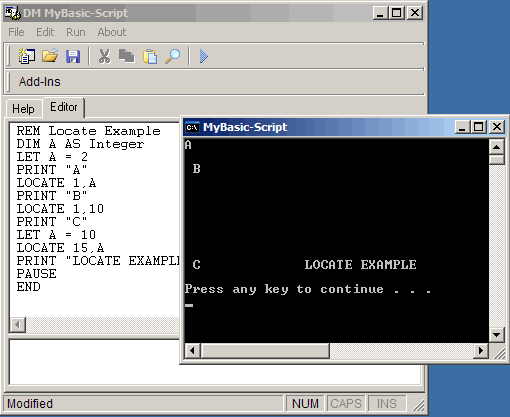



## DM MyBasic Script Engine

### Description

DM MyBasic Script Engine will be an on going slow process into showing a beginner how to Built there own little Basic scripting language. The syntex of this project will be QBasic.

At the moment this projects shows the user of 10 Keywords, PRINT, CLS, BEEP, END, PAUSE, LOCATE, INPUT and some more

at the moment it supports 3 Variable data types String, Integer and Variant. Supports expressions such as 2+5 2+(2*5) etc. comes with a very basic IDE and some example scripting. That show all keywords used in this version.

Note that unlike my other scripting programs. Each of the bas files subs and functions are commented. also see the docs/doc.htm for the Language guide.

Please vote.
 
### More Info
 

             |
---                |---
**Submitted On**   |2005-05-06 04:10:14
**By**             |[dreamvb](https://github.com/Planet-Source-Code/PSCIndex/blob/master/ByAuthor/dreamvb.md)
**Level**          |Intermediate
**User Rating**    |5.0 (10 globes from 2 users)
**Compatibility**  |VB 5\.0, VB 6\.0
**Category**       |[Coding Standards](https://github.com/Planet-Source-Code/PSCIndex/blob/master/ByCategory/coding-standards__1-43.md)
**World**          |[Visual Basic](https://github.com/Planet-Source-Code/PSCIndex/blob/master/ByWorld/visual-basic.md)
**Archive File**   |[DM\_MyBasic188523562005\.zip](https://github.com/Planet-Source-Code/dreamvb-dm-mybasic-script-engine__1-60391/archive/master.zip)

